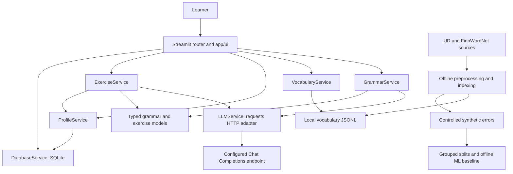

# Finnish Learning Assistant

A local Streamlit application for checking Finnish sentences, understanding corrections, looking up vocabulary, and practising recurring grammar mistakes. It combines configurable LLM services, a corpus-derived vocabulary index, SQLite learner history, and a separate offline machine-learning experiment.

## Overview

This is an educational MVP with an implemented learner workflow and retained evaluation evidence. It is not a production-ready platform or a substitute for a Finnish teacher. Structural validation and automated tests establish software behavior; they do not guarantee linguistic correctness.

The application has **six views** routed by [app.py](app.py): Home, Grammar Checker, Vocabulary, My Mistakes, Practice, and About. Implementations live in `app/ui/`, rather than a top-level `pages/` directory.

| Component | Current implementation | Dependency |
| --- | --- | --- |
| Grammar feedback | Corrections, categories, explanations, learning tips, uncertainty metadata | Runtime LLM |
| Vocabulary | Lemmas, POS, observed morphology, English sense candidates, examples, provenance | Local precomputed index |
| History and weaknesses | Persistent grammar checks/errors; deterministic category counts and ranking | SQLite |
| Practice | Basic multiple-choice generation for five topics; local answer checking | LLM generation; deterministic checking |
| Corpus processing | Validated CoNLL-U parsing, traceable JSONL, vocabulary indexing | Offline source data |
| ML baseline | Three-class synthetic error classification | Offline scikit-learn pipeline; experimental |

## Key Features

### Grammar Assistant

Submit one Finnish sentence, up to **500 characters**, using standard written or colloquial-tolerant mode. A validated result contains original/corrected text, up to five errors, per-error explanations and provider-reported confidence, an overall explanation, and a learning tip.

The implemented taxonomy is `CASE_ERROR`, `VERB_CONJUGATION`, `NOUN_INFLECTION`, `WORD_ORDER`, `AGREEMENT`, `SPELLING`, and `OTHER`. There is no separate runtime `PLURAL` category. Correct results must preserve the input exactly and contain no errors. Uncertain results require a note. Confidence values are not calibrated probabilities.

### Vocabulary

Look up a single word or observed inflected form. Unicode normalization and case-folding support Finnish characters. Results preserve alternative lemma/POS analyses and observed morphological feature signatures, with frequencies, attribution, and a corpus example where available. At most five candidate analyses are displayed, with a warning when more exist.

English meanings come from FinnWordNet overlap, not an LLM. Missing meanings and unknown words are handled explicitly. This index is **not a complete Finnish dictionary, morphological analyzer, or inflection generator**; meanings are unranked sense candidates.

### Learning History and Personalization

Validated grammar checks and their errors are saved together in one SQLite transaction. Stored information includes sentence text, correction, explanations, categories, confidence, language mode, uncertainty status, and UTC timestamp. My Mistakes displays the latest 20 checks with filters and a weakness summary.

The profile counts errors by category, excludes uncertain analyses from error statistics, calculates percentages, and ranks by descending count with alphabetical category tie-breaking. Correct checks contribute to check totals without adding errors. Confidence is stored but does not weight the profile.

This is frequency-based personalization. Practice chooses the highest-ranked supported weakness; learners can also open a topic from grammar feedback. Without a supported weakness, they must choose a topic explicitly. Exercise answers do not update the profile.

### Exercises

Generate one `BASIC`, four-option multiple-choice exercise for `CASE_ERROR`, `VERB_CONJUGATION`, `NOUN_INFLECTION`, `AGREEMENT`, or `SPELLING`. `WORD_ORDER` and `OTHER` are excluded from generation.

Answer checking compares the selected option with the generated answer locally and displays the explanation supplied with the exercise. It makes no additional LLM call. Exercises and submitted answers remain in Streamlit session state; **there is no persistent exercise or attempt history**.

## Application Workflow

```text
Submit a sentence
  → LLM analysis → typed validation → feedback
  → SQLite grammar check and error records
  → category counts and ranked weaknesses
  → supported topic selection → LLM-generated exercise
  → typed validation → local answer comparison and explanation

Vocabulary lookup → local UD/FinnWordNet index → lexical results
```

Provider actions run on explicit submissions. Rendering or rerunning a page does not repeat analysis, insertion, or exercise generation. Submitting the same sentence again is a new check: this is rerun safety, not a database-wide deduplication guarantee. If saving fails after analysis, the UI retains feedback and displays a persistence warning.

## Architecture



- **UI:** `app.py` routes views; `app/ui/services.py` caches stable resources. Page modules handle explicit actions and session state.
- **Services:** `app/services/` coordinates grammar, vocabulary, persistence, profiles, and exercises. Offline preprocessing/training are separate modules in the same package.
- **Domain models:** `app/models/` contains dataclasses, enums, and explicit validation. Root `models/` instead holds the trained classifier.
- **Prompts/configuration:** `app/prompts/` holds versioned templates; `app/config.py` and LLM settings read the environment.
- **Evaluation:** `app/evaluation/system_evaluation.py` scores components separately and retains failures.

The UI persists validated grammar results; the LLM never writes to SQLite. The offline classifier has **no connection to runtime grammar decisions or fallback behavior**. [Architecture documentation](docs/ARCHITECTURE.md) provides implementation snapshots, but its earlier conceptual hybrid diagrams describe plans rather than the current grammar path.

### Runtime LLM Boundary

[LLMService](app/services/llm_service.py) uses `requests` to POST to `{LLM_API_BASE_URL}/chat/completions` with Bearer authentication. Requests contain a system prompt and JSON-encoded user payload, configurable model/temperature/output limit, and `response_format: {"type": "json_object"}`. Grammar sends the sentence and language mode; exercises send topic, type, and difficulty, without learner identity or database history.

The schema is embedded in the prompt. JSON-object mode is requested, but the transport does not enforce a provider-side strict JSON Schema. It parses the envelope and content; services then validate required fields, enums, bounds, and cross-field consistency using [domain models](app/models/).

Each service permits one repair request after malformed/invalid output. Transport retries are separately bounded to at most one for transient failures. Authentication/configuration failures produce controlled messages. Missing credentials do not prevent local views from starting, but new grammar analyses and exercises need a working provider. There is no local grammar fallback. Endpoints must support the adapter's request fields; compatibility is not established for every provider.

## Technology Stack

| Area | Technology | Purpose |
| --- | --- | --- |
| Language | Python 3.12; inspected environment/model metadata: 3.12.14 | Application and offline workflows |
| UI | `streamlit==1.63.0` | Six views, forms, session state, AppTest |
| Storage | Python `sqlite3` / SQLite | Local grammar history |
| LLM integration | `requests==2.34.2`, `python-dotenv==1.2.3` | HTTP transport and configuration |
| Data analysis | `pandas==3.0.5`, `numpy==2.5.3` | Exploration and metrics |
| ML | `scikit-learn==1.9.0`; joblib serialization | TF-IDF and Logistic Regression |
| Visualization | `matplotlib==3.11.1`, `seaborn==0.13.2` | Notebook analysis and plots |
| Notebooks | `ipykernel==7.3.0`, `nbclient==0.11.0` | Data/ML/evaluation notebooks |
| Testing | `pytest==9.1.1` | Unit, integration, UI, artifact checks |

Direct dependencies are pinned in [requirements.txt](requirements.txt); this is not a complete transitive dependency lockfile. No repository-wide minimum Python version is declared. Python 3.12 is the documented and locally verified environment.

## Data Sources

| Source | Provides | Actual project use |
| --- | --- | --- |
| [UD Finnish-TDT](https://universaldependencies.org/treebanks/fi_tdt/index.html) | Sentences, lemmas, POS, morphology, dependencies | Processed corpus, observed forms/examples, controlled error generation |
| [UD Finnish-FTB](https://universaldependencies.org/treebanks/fi_ftb/index.html) | Annotated Finnish grammatical examples | Same offline corpus and synthetic-data workflow |
| [FinnWordNet 2.0](https://www.kielipankki.fi/download/FinnWordNet/v2.0/README.txt) | Lexical mappings, POS, English translations/glosses | Meanings joined to corpus lemma/POS entries; qualified translations and multiword Finnish terms excluded |

Neither treebank is an authentic learner-error corpus. Runtime exercise generation uses the selected category and prompt, rather than retrieving treebank sentences.

Counts below come from retained manifests and were checked against local JSONL artifacts:

| Artifact | Statistics | Evidence |
| --- | --- | --- |
| Processed corpus | **33,859 sentences; 361,818 word tokens** | [Preprocessing manifest](data/processed/preprocessing_manifest_v1.json) |
| TDT contribution | 15,136 sentences; 202,193 word tokens | Same manifest |
| FTB contribution | 18,723 sentences; 159,625 word tokens | Same manifest |
| Vocabulary index | **40,624 analysis records; 93,547 distinct lookup keys** | [Vocabulary manifest](data/vocabulary/vocabulary_manifest_v1.json) |
| English meanings | 12,070 analysis records have meanings | Same manifest |
| Synthetic errors | **3,000 examples**, 1,000 per class | [Generation manifest](data/errors/error_generation_manifest_v1.json) |

Word-token counts exclude separately retained multiword-token rows and empty nodes. Lookup keys include normalized lemmas and observed forms; they are not dictionary headword counts. See [Data Sources](docs/DATA_SOURCES.md) and [vocabulary attribution](data/vocabulary/ATTRIBUTION.md).

## Data Processing and Reproducibility

```text
Pinned UD train/dev/test CoNLL-U files
  → syntax, token, feature, and dependency validation
  → sentence JSONL preserving original text and annotations
  ├─ + FinnWordNet → corpus-bounded vocabulary index
  └─ controlled token substitutions → synthetic errors
       → grouped train/validation/test splits → fitted ML pipeline
```

Preprocessing retains source dataset, commit, file, split, sentence ID, and an NFC-text hash as `leakage_group_id`. Duplicate source texts are retained and grouped. Manifests record source/output SHA-256 hashes, counts, configuration, and quality checks. These make the offline experiment auditable; they do not make external LLM responses deterministic.

### Optional Offline Rebuild

**No preprocessing or training is required to launch with the included vocabulary index.** Raw sources are ignored by Git. To rebuild, acquire the pinned treebanks:

```bash
git clone https://github.com/UniversalDependencies/UD_Finnish-TDT.git data/raw/finnish_tdt
git -C data/raw/finnish_tdt checkout bfaae13719f249573d940edda6a0d7aa8eec620f
git clone https://github.com/UniversalDependencies/UD_Finnish-FTB.git data/raw/finnish_ftb
git -C data/raw/finnish_ftb checkout 2dd197c1f7c4b9b6d69be1e3f826162a4443af96
```

Download the [official FinnWordNet archive](https://www.kielipankki.fi/download/FinnWordNet/v2.0/FinnWordNet-2.0.zip) to `data/raw/vocabulary/FinnWordNet-2.0.zip`, then run the relevant steps from the repository root:

```bash
python -m app.services.data_preprocessing --project-root .
python -m app.services.vocabulary_service --project-root .
python -m app.services.error_generation --project-root .
python -m app.services.ml_training --project-root .
```

These overwrite versioned outputs/manifests; training also replaces split, prediction, model, and metadata artifacts. Use them deliberately. Notebooks [01–05](notebooks/) document exploration, preprocessing, synthetic generation, ML, and evaluation; some execute these writing workflows.

## Offline ML Baseline

[ml_training.py](app/services/ml_training.py) trains a scikit-learn pipeline:

```text
Already-incorrect sentence
  → NFC / whitespace / punctuation-spacing feature normalization
  → character-within-word TF-IDF, 3–5 grams
  → Logistic Regression → one of three synthetic error labels
```

Labels are `AGREEMENT`, `CASE_ERROR`, and `VERB_CONJUGATION`. Generation replaces one aligned token with a corpus-attested form using adjective number mismatch, adjective case mismatch, or finite-verb person/number mismatch rules. It retains source text, correction, generation rule, and provenance. There is no correct-sentence class and no neural network.

Seed **42** and `StratifiedGroupKFold` with 20 folds produce **2,101 training**, **450 validation**, and **449 test** records, approximating 70/15/15. Stratification uses label and source dataset; each `leakage_group_id` stays in one partition. The [split manifest](data/evaluation/ml_split_manifest_v1.json) reports zero pairwise group intersections. TF-IDF and the classifier are fitted only on training examples.

Grouping protects related variants and identical NFC source texts from crossing partitions. It does not establish complete protection against near-duplicate text, shared lexical patterns, or source shortcuts. Corpus-wide observed forms are used during synthetic construction before splitting.

The saved [pipeline](models/error_classifier_v1.joblib) has [configuration and metrics](models/error_classifier_v1_metadata.json) and [test predictions](data/evaluation/ml_test_predictions_v1.jsonl). Use the project's `load_pipeline` helper, which handles the frozen artifact's custom-normalizer compatibility issue.

Saved test accuracy is **0.7104677 (71.05%)**, macro F1 **0.7092019**, and log loss **0.7035128** on 449 synthetic examples. These measure three-class classification of already-incorrect sentences, not overall Finnish correctness or runtime grammar feedback.

## Project Structure

```text
finnish_learning_assistant/
├── app.py                     Streamlit entry point and router
├── app/
│   ├── ui/                    Six views, theme, caching, session state
│   ├── services/              Runtime services and offline processing/training
│   ├── models/                Validated domain dataclasses and enums
│   ├── prompts/               Grammar and exercise templates
│   ├── evaluation/            Component evaluator and report generation
│   └── utils/                 Logging and application errors
├── data/
│   ├── raw/                   Ignored upstream acquisitions
│   ├── processed/             Corpus JSONL and manifest
│   ├── vocabulary/            Lookup index, manifest, attribution
│   ├── errors/                Synthetic errors and manifest
│   └── evaluation/            Splits, cases, provider outputs, review records
├── database/                  Ignored runtime SQLite database
├── models/                    Offline classifier and metadata
├── notebooks/                 Five data/ML/evaluation notebooks
├── docs/                      Specification, architecture, sources, presentation
├── reports/                   Saved evaluation and release checklists
├── tests/                     Automated test suite
├── .streamlit/config.toml     UI theme
├── .env.example               Configuration template
└── requirements.txt           Pinned direct dependencies
```

## Installation

Use **Python 3.12** and Git. The inspected environment is Windows with Python 3.12.14; the release checklist records a previous fresh-environment installation. Linux/macOS activation is included, but those platforms were not verified in this audit.

```bash
git clone https://github.com/leanhtrunghieu/finnish_learning_assistant.git
cd finnish_learning_assistant
python -m venv .venv
```

Ensure `python` selects Python 3.12. On Windows, `py -3.12 -m venv .venv` is an alternative if that version is registered with the launcher.

Windows PowerShell:

```powershell
.\.venv\Scripts\Activate.ps1
python -m pip install -r requirements.txt
Copy-Item .env.example .env
```

Linux/macOS:

```bash
source .venv/bin/activate
python -m pip install -r requirements.txt
cp .env.example .env
```

If PowerShell activation is unavailable, invoke `.\.venv\Scripts\python.exe` directly for installation/tests and `.\.venv\Scripts\streamlit.exe` to launch.

## Configuration

Edit `.env` using [the existing template](.env.example):

```dotenv
APP_TITLE=Finnish Learning Assistant
APP_ENV=development
LOG_LEVEL=INFO
LLM_PROVIDER=openai_compatible
LLM_API_KEY=
LLM_API_BASE_URL=https://api.openai.com/v1
LLM_MODEL=
LLM_TIMEOUT_SECONDS=20
LLM_MAX_OUTPUT_TOKENS=800
LLM_TEMPERATURE=0
LLM_MAX_RETRIES=1
```

| Setting | Meaning |
| --- | --- |
| `APP_TITLE`, `APP_ENV`, `LOG_LEVEL` | Title, environment label, logging level |
| `LLM_PROVIDER` | Only `openai_compatible` is implemented |
| `LLM_API_KEY` | Credential required for requests |
| `LLM_API_BASE_URL` | Base URL; adapter appends `/chat/completions` |
| `LLM_MODEL` | Available compatible chat model; no default model |
| `LLM_TIMEOUT_SECONDS` | Positive per-request timeout |
| `LLM_MAX_OUTPUT_TOKENS` | Positive limit sent as `max_completion_tokens` |
| `LLM_TEMPERATURE` | Sampling setting from 0 to 2 |
| `LLM_MAX_RETRIES` | Transport retries: 0 or 1 |

Set key, URL, and model for grammar/practice generation. Runtime is not tied to the historical evaluation model. Restart after changes because settings/services are cached. `.env`, databases, and `.streamlit/secrets.toml` are ignored; never commit credentials.

## Running the Application

From the repository root, with the environment activated:

```bash
streamlit run app.py
```

Open the URL printed by Streamlit, normally `http://localhost:8501`. The database service creates `database/finnish_learning_assistant.db` and its schema automatically when first used. No migration/setup command is required. The UI uses fixed identity `demo_user` and has no authentication.

Vocabulary requires the included `data/vocabulary/vocabulary_index_v1.jsonl`. History/profile use SQLite. Raw corpora and the trained ML artifact are not runtime prerequisites. A missing index produces an unavailable vocabulary view; rebuild it with the offline procedure if needed.

## Testing

```bash
python -m pytest -q
```

The README audit on **2026-09-27**, using the existing Python 3.12.14 environment, ran successfully: **164 passed, 3 skipped**. This was not a fresh dependency installation or new live linguistic evaluation. The older [release checklist](reports/final_release_checklist.md) records **162 passed, 3 skipped** for its frozen state.

Tests cover CoNLL-U validation, synthetic generation, grouped splitting, model save/load and metrics, LLM transport/parsing, domain validation, transactions, profiles, vocabulary, exercise checking, evaluation aggregation, and Streamlit navigation/rerun behavior. Normal provider tests use fake clients or HTTP sessions; database tests use temporary storage. Artifact checks load retained data/model and compare saved evidence.

The three [live smoke tests](tests/test_llm_integration.py) are skipped unless `RUN_LIVE_LLM_TESTS=1` is set with valid configuration. Enabling them sends real API requests and may incur charges. Default test success does not establish current API availability.

## Evaluation

These are **historical saved results**, documented in [final_evaluation.md](reports/final_evaluation.md) and [final_evaluation_v1.json](reports/final_evaluation_v1.json), dated **2026-09-13**. Metadata identifies `openai_compatible`, model `gpt-5.6-luna`, and temperature 0; this describes that evaluation, not a required runtime model.

| Component / measure | Saved result | Scope |
| --- | --- | --- |
| Grammar structured output | 39/40 = 97.50% | One invalid result retained |
| Grammar detection F1 | 94.44% | 39 actual predictions from 40 cases |
| Grammar false positives | 1/22 = 4.55% | Frozen valid sentences; one had no prediction. Among 21 valid sentences with predictions: 4.76% |
| Grammar exact correction | 17/18 = 94.44% | Erroneous cases; one incorrect correction |
| Single-error category match | 10/12 = 83.33% | Only two cases per evaluated category |
| Exercise structural validity | 20/20 = 100% | Four attempts per supported category |
| Exercise answer correctness | 19/20 PASS | AI-assisted qualitative review |
| Exercise distractor plausibility | 11/20 PASS | Eight PARTIAL, one FAIL |
| Vocabulary | 16/16 lookup-status checks passed | Small source-audited set; other criteria have applicable-case denominators |
| Profile / target selection | 6/6 histories; 4/4 profiles passed | Controlled deterministic scenarios |
| Offline ML test | Accuracy 71.05%; macro F1 0.7092 | 449 synthetic examples |
| Integrated workflow | 12/12 scenarios passed; startup health passed | Saved controlled UI/process checks |

The grammar set contains 22 valid and 18 erroneous cases with human-authored expectations according to data documentation. Explanation/exercise judgments are **AI-assisted qualitative linguistic reviews**, not independent native-speaker or Finnish-teacher validation. Structure checks verify fields and option consistency, not whether an answer is linguistically correct.

Raw [grammar outputs](data/evaluation/grammar_evaluation_results_v1.jsonl), [exercise outputs](data/evaluation/exercise_evaluation_results_v1.jsonl), and separate [grammar](data/evaluation/grammar_manual_reviews_v1.jsonl) / [exercise](data/evaluation/exercise_manual_reviews_v1.jsonl) reviews retain failures and notes. No live evaluation was rerun for this README.

To rebuild reports from retained outputs without provider calls:

```bash
python -m app.evaluation.system_evaluation --project-root . --reuse-live-results --run-tests --include-startup-smoke
```

This **rewrites evaluation reports/checklist**. Omitting `--reuse-live-results` invokes provider-backed evaluation. Prefer inspecting saved evidence unless a rebuild is intended.

The saved evaluation notebook can be executed separately:

```bash
jupyter execute --inplace --timeout=600 notebooks/05_evaluation.ipynb
```

This updates notebook outputs. The previous Windows release procedure used writable runtime directories when needed:

```powershell
$env:PYTHONUTF8 = "1"
$env:IPYTHONDIR = "$PWD\tmp\ipython"
$env:JUPYTER_CONFIG_DIR = "$PWD\tmp\jupyter-config"
$env:JUPYTER_DATA_DIR = "$PWD\tmp\jupyter-data"
$env:JUPYTER_RUNTIME_DIR = "$PWD\tmp\jupyter-runtime"
```

## Known Limitations

- **Linguistic reliability:** saved grammar results include false acceptance, false correction, category errors, and incorrect/oversimplified explanations. Colloquial handling and Finnish object terminology remain imperfect. Schema validation cannot establish linguistic truth.
- **Exercise quality:** `noun_inflection_03` has an incorrect saved answer/explanation. Nine of 20 exercises have weak distractors. Local checking trusts the generated answer and can reinforce a provider mistake.
- **Small samples:** 40 grammar cases, 16 vocabulary queries, and 20 exercises do not establish broad learner performance. Qualitative reviews are AI-assisted; formal user-study evidence is absent.
- **Provider dependence:** new feedback/exercises need API availability and potentially paid access. Responses can vary despite temperature 0. The later release rehearsal recorded a failed live grammar request despite the earlier successful evaluation; current availability was not checked here. API costs were not formally measured; the optional repeatability sample was not rerun.
- **Vocabulary:** only observed corpus entries are indexed; many lack English meanings. No context-based sense ranking or complete paradigms are provided.
- **ML generalization:** synthetic data covers three labels. Train/test macro F1 falls from 0.9331 to 0.7092; suffix, source, and sentence-length shortcuts remain risks. Authentic learner-error performance is unestablished.
- **Local learner model:** all UI activity uses `demo_user`; no authenticated multi-user isolation is offered. Profiles use accumulated grammar counts without recency weighting, mastery tracking, or exercise-result updates. Practice state is not durable.

## AI Usage

At runtime, an external LLM analyzes sentences and generates exercise questions, options, answers, and explanations. Vocabulary, persistence, profile ranking, and answer comparison run locally. The classical ML baseline is a separate educational experiment.

[docs/master_prompt.md](docs/master_prompt.md) documents an AI-assisted development workflow involving Copilot, and evaluation artifacts label qualitative reviews as AI-assisted. Development assistance and runtime use are different roles. The repository does not establish what proportion of implementation was AI-assisted; these reviews should not be treated as independent linguistic validation.

## Future Improvements

- Expand evaluation with independent Finnish-teacher review and authentic learner examples.
- Add linguistic checks for generated answers, ambiguity, and distractor quality.
- Improve lexical coverage and context-sensitive meaning selection.
- Persist practice outcomes and evaluate recency-aware personalization.
- Test stronger ML baselines while auditing source shortcuts and near-duplicate leakage.

## Project Status and Presentation

The core local learner workflow is implemented as an educational MVP. Offline experiments and saved evaluations support review/demonstration, while broader linguistic validation, durable practice history, personalization, and multi-user deployment remain future work. A release checklist's PASS verdict does not establish production readiness or current provider availability.

Supporting material:

- [Project specification](docs/PROJECT_SPEC.md)
- [Final presentation](docs/presentation/final_presentation.pptx)
- [Demo and defense notes](docs/presentation/demo_and_defense_notes.md)
- [End-to-end evidence](reports/end_to_end_checklist_v1.md)
- [Historical release checklist](reports/final_release_checklist.md)

During provider outages, use included screenshots/preserved outputs labeled **Previously recorded real system output**, as documented in the demo notes. They demonstrate prior behavior, not a live request.

## License and Data Attribution

No project-level software license is currently specified. Upstream data retains its own attribution and license requirements:

- **UD Finnish-TDT:** CC BY-SA 4.0, recorded in source documentation and the upstream license.
- **UD Finnish-FTB:** CC BY 4.0; its upstream license also offers an LGPLv3+ alternative.
- **FinnWordNet 2.0:** Princeton WordNet license plus CC BY 3.0 for University of Helsinki translations. Preserve the Princeton copyright notice and University of Helsinki attribution.

See [Data Sources](docs/DATA_SOURCES.md) and [Vocabulary Attribution](data/vocabulary/ATTRIBUTION.md) for URLs and provenance. Derived corpus, vocabulary, and synthetic artifacts do not remove upstream attribution obligations.
